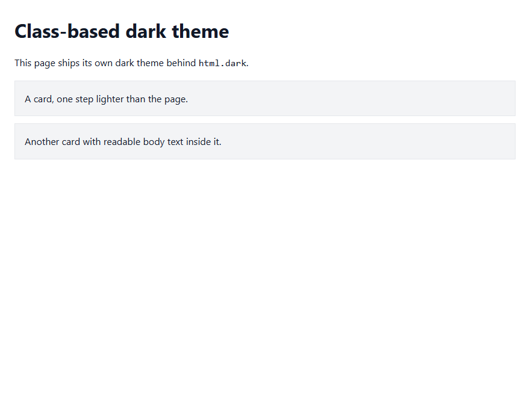
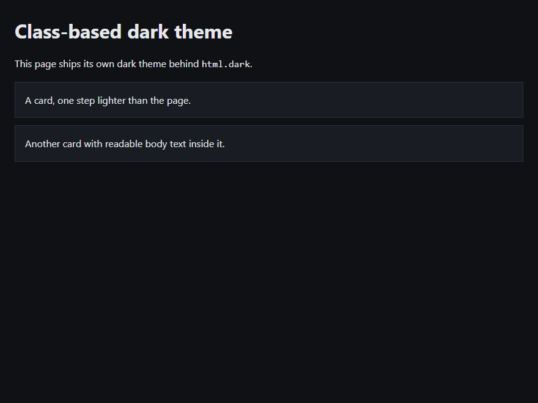
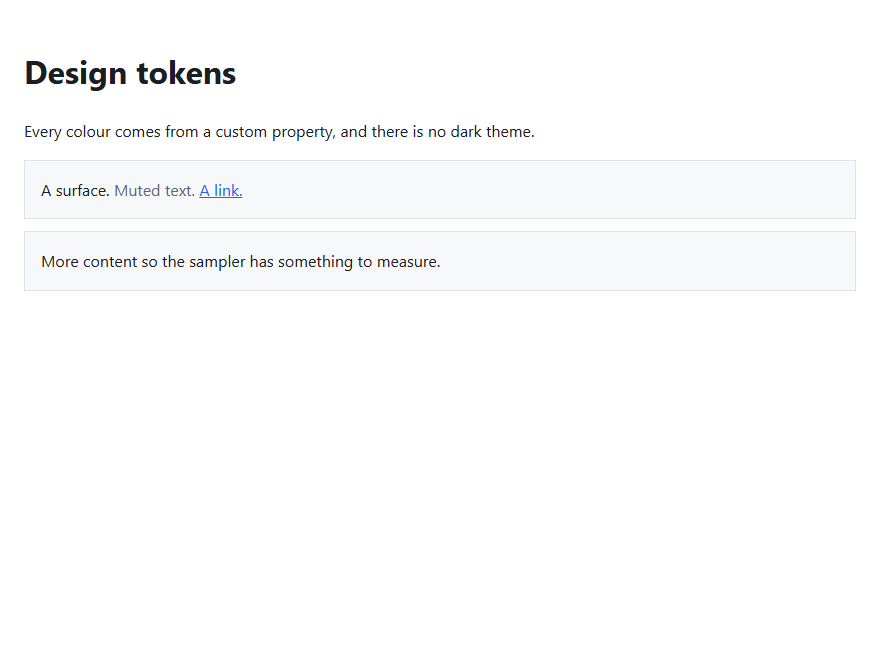
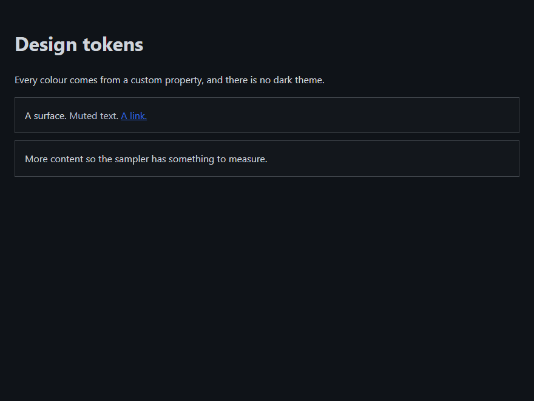
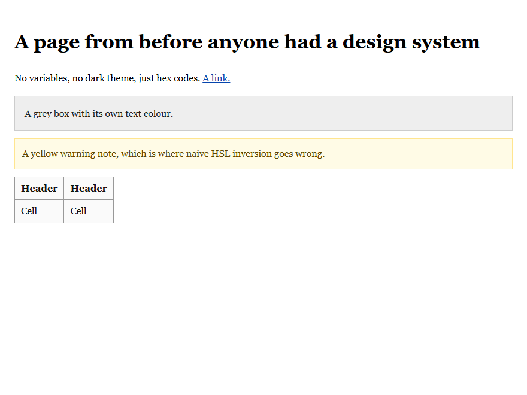
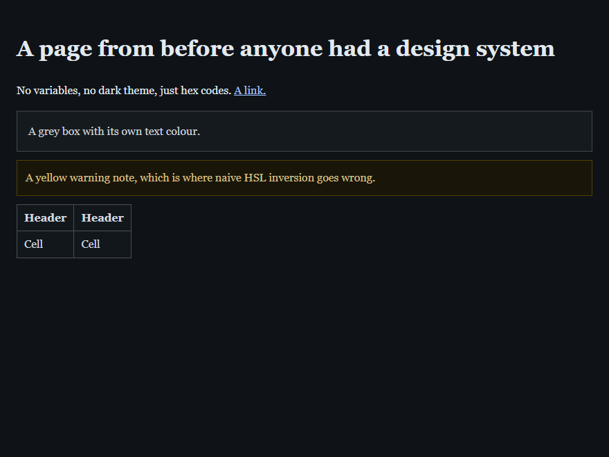
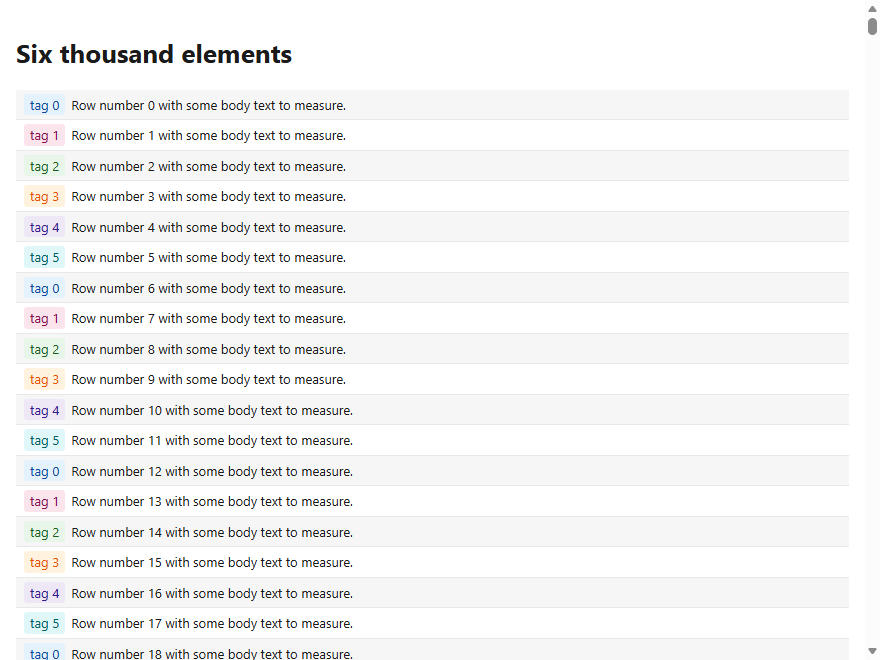
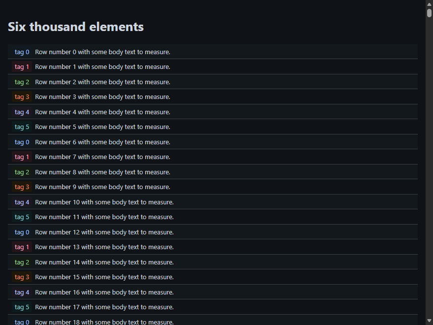
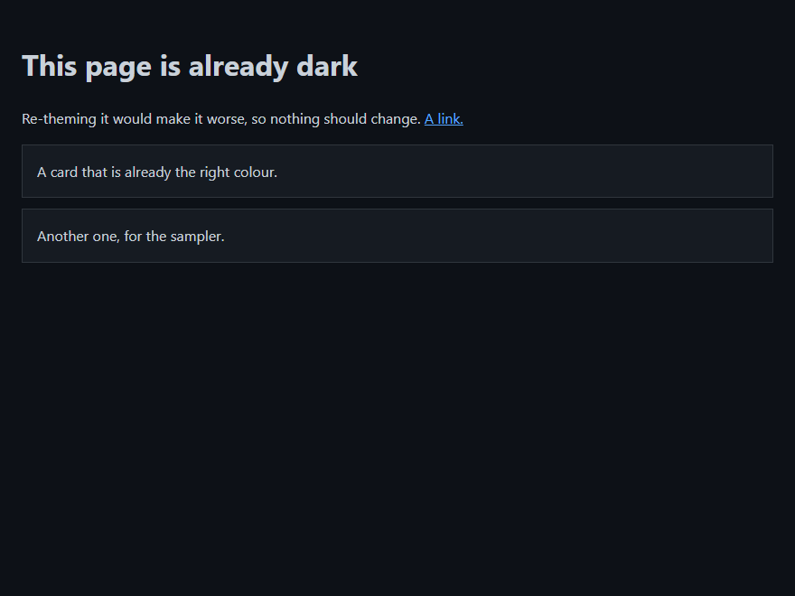
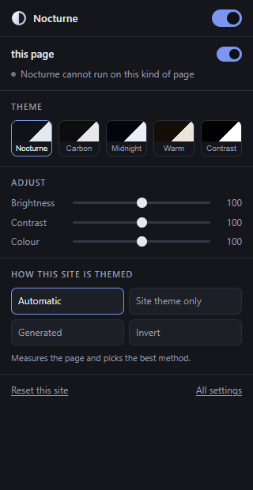

# Nocturne

Dark mode for Chrome and Firefox that starts by asking whether the site already has
one.

Most dark mode extensions do the same thing to every page: parse the CSS, recolour
everything, and keep doing it forever as the page changes. That is the most expensive
strategy available, and it gets applied even to the large and growing number of sites
that ship a perfectly good dark theme of their own, which then gets replaced by an
approximation of itself.

Nocturne is an escalation ladder. It tries the cheapest thing that could work,
**measures whether the page actually came out dark and readable**, and only escalates
when the measurement says it has to.


On a site with its own dark mode the ladder stops at rung 1 having done almost no
work, and what you get is that site's theme, authored by the people who designed the
site. On a site without one, it generates a theme, and checks its own result.

## What it looks like

Every pair below is a real capture of the same fixture page with the extension off
and on, produced by `node tools/shots.mjs`. The fixtures are in `test/fixtures` and
each one isolates a single rung.

**Rung 1, a site with its own dark theme behind `html.dark`.** Nocturne switches the
site's own class on. The result is the designer's theme, not an approximation of it.

<table>
<tr><th width="50%">Off</th><th width="50%">On</th></tr>
<tr valign="top">
<td></td>
<td></td>
</tr>
</table>

**Rung 2, a site built on design tokens.** The tokens are remapped, so the page keeps
its own spacing, borders and accent colours.

<table>
<tr><th width="50%">Off</th><th width="50%">On</th></tr>
<tr valign="top">
<td></td>
<td></td>
</tr>
</table>

**Rung 3, a legacy page with no dark theme and no tokens.** Colours are sampled from
the rendered page and rewritten. The yellow warning note is the interesting part:
naive HSL inversion turns it blue, and doing the work in OKLCh leaves it yellow.

<table>
<tr><th width="50%">Off</th><th width="50%">On</th></tr>
<tr valign="top">
<td></td>
<td></td>
</tr>
</table>

**Six thousand elements.** The colour work is deduplicated, so a heavy page costs
about what a light one does, and the six tag colours stay distinguishable from each
other rather than collapsing into one hue.

<table>
<tr><th width="50%">Off</th><th width="50%">On</th></tr>
<tr valign="top">
<td></td>
<td></td>
</tr>
</table>

**A page that is already dark is left alone.** Rung 0 measures it, finds nothing to
do, and stops.

<table>
<tr><th width="50%">Off</th><th width="50%">On</th></tr>
<tr valign="top">
<td></td>
<td></td>
</tr>
</table>

The popup reports which method was used on the page you are looking at, and lets you
pin a different one.




## What is actually different

**It uses the site's own dark theme.** Most sites that support dark mode do it with a
class or attribute on the root element rather than a media query: `html.dark`,
`[data-theme="dark"]`, `[data-bs-theme="dark"]` and a dozen similar conventions.
Nocturne recognises them, switches the right one on, and confirms the page went dark.
That is a `classList.add` producing a pixel-perfect result.

**Every rung is measured, not assumed.** After each attempt Nocturne samples the
rendered page on a grid, resolves the colour actually painted at each point, and
computes how much of the screen is still light and whether the text is still legible.
A rung that fails is reverted. This is what makes "try the cheap thing first" safe
rather than a gamble.

**It understands modern colour.** `getComputedStyle` returns `oklch()`, `oklab()`,
`lab()`, `lch()` and `color()` verbatim rather than converting them to `rgb()`. A
parser written for the `rgb()` era silently fails on any site built with a current
token pipeline. Nocturne parses all of them, and does its own work in OKLCh, which is
perceptually uniform, so moving lightness leaves hue and saturation where the designer
put them. Yellows stay yellow.

**Contrast is enforced, not hoped for.** After mapping, every text and background pair
is checked and separated until it clears a configurable ratio.

**It never inverts your images.** Photos, video, canvas and logos are left alone.
Inverted images are the single most common complaint about this category of extension
and the fix is to not do it.

**No white flash.** The anti-flash shell is a stylesheet applied at `document_start`.
It is CSS with no JavaScript behind it on purpose, because every scripted path,
including `scripting.insertCSS` from the service worker, runs strictly after the first
paint.

**It makes no network requests.** Not for stylesheets, not for site fixes, not for
analytics. The build refuses to produce a package if any networking primitive appears
anywhere in the source.

**It gets out of the way.** A page that is already dark is left completely untouched.
A page that cannot be themed within its performance budget is demoted to a cheaper
method automatically and that decision is remembered.

## Permissions

- **No host permissions at install.** Nothing is requested up front.
- **A content script on all sites, at `document_start`.** This is unavoidable: an
  extension that cannot run before the first paint cannot prevent the flash, and that
  is the product. Your browser will tell you this at install and the description above
  does not pretend otherwise.
- **`storage`** for your settings, **`alarms`** for the schedule, **`scripting`** for
  the optional feature below.
- **`<all_urls>`, optional and off by default.** Turning on "stubborn sites" asks for
  it. A page can write `background-color: #fff !important` into an inline style
  attribute, and per the CSS cascade no author-origin stylesheet can outrank that.
  User-origin CSS can, and `scripting.insertCSS` is the only way to produce it. That
  is the whole reason the option exists.

## Install

**Firefox:** [Nocturne Dark Mode on addons.mozilla.org](https://addons.mozilla.org/firefox/addon/nocturne-dark-mode/).

Not on the Chrome Web Store yet. To run it from source:

```bash
git clone https://github.com/TiltedLunar123/nocturne.git
cd nocturne
node tools/build.mjs
```

Chrome or Edge: open `chrome://extensions`, turn on Developer mode, choose **Load
unpacked**, and pick `dist/chrome`.

Firefox: open `about:debugging#/runtime/this-firefox`, choose **Load Temporary
Add-on**, and pick `dist/firefox/manifest.json`.

## Development

```bash
node tools/build.mjs --check    # build both targets and run the release gate
node --test test/*.test.mjs     # unit tests
node tools/e2e.mjs              # drive a real browser against the fixtures
node tools/e2e-settings.mjs     # mode pinning, and the user-origin cascade claim
node tools/e2e-ui.mjs           # render the popup and options page, fail on any error
node tools/shots.mjs            # before and after screenshots into docs/shots
node tools/probe-platform.mjs   # re-verify the platform facts in PLAN.md
node tools/probe-colors.mjs
```

There is no bundler and nothing is minified. The libraries are plain classic scripts
that attach to an `NX` global, and the build concatenates them. What ships is what is
written here.

The end-to-end suite drives Edge rather than Chrome, because branded Google Chrome
ignores `--load-extension` and the extension would silently never load.

`PLAN.md` holds the architecture, the platform facts each decision rests on, and the
measurements behind them. Read it before changing a tier.

## Known limits

These are real and stated rather than hidden.

- **Closed shadow roots** cannot be reached by any extension without the page
  cooperating. Components built that way stay light.
- **Canvas and WebGL applications** draw pixels, not CSS. Rung 4 can invert the whole
  surface, which is usually worse than leaving it. Use the application's own dark
  theme.
- **Cross-origin stylesheets** cannot be read: `cssRules` throws for them. That means
  rungs 1b and 2 see less than the whole page on some sites. The measurement notices
  and escalates. Working around this is why other extensions in this category fetch
  stylesheets over the network, which Nocturne will not do.
- **Rung 3 forces text and background colours**, so a page's own hover tint on those
  two properties is flattened. Borders, outlines and shadows are left at normal weight
  precisely so interaction states on those keep working. Rungs 1 and 2 have no such
  problem, and modern sites reach them.
- **Browser chrome and restored tabs** can still flash. That is the browser painting,
  not the page, and no content script runs early enough to prevent it.

## Licence

MIT.

If it saved your eyes an evening, you can [buy me a coffee](https://buymeacoffee.com/judeh1l).
Entirely optional, and nothing in the extension is behind it.
